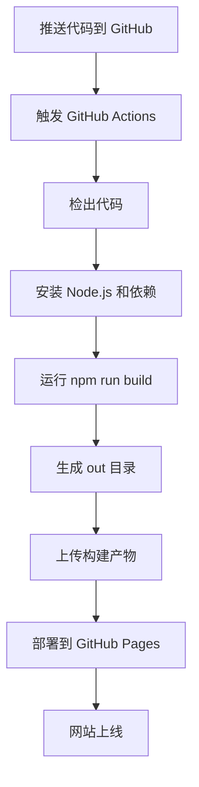

# 部署配置摘要 📋

本文档总结了为 cto.new 中文网站配置的所有 GitHub Pages 部署功能。

## ✅ 已完成的配置

### 1. Next.js 静态导出配置

**文件**: `next.config.ts`

```typescript
{
  output: 'export',              // 启用静态导出
  images: { unoptimized: true }, // 禁用图片优化（GitHub Pages 不支持）
  basePath: process.env.NEXT_PUBLIC_BASE_PATH || '', // 支持子路径
  trailingSlash: true,          // 启用尾部斜杠
}
```

### 2. GitHub Actions 工作流

**文件**: `.github/workflows/deploy.yml`

- ✅ 自动触发：推送到 main/master 分支
- ✅ 手动触发：可通过 Actions 界面手动运行
- ✅ 构建步骤：安装依赖、构建项目
- ✅ 部署步骤：上传到 GitHub Pages
- ✅ 权限配置：正确的读写权限

### 3. 静态文件配置

**文件**: `public/.nojekyll`

- ✅ 禁用 Jekyll 处理
- ✅ 保留下划线开头的文件（如 _next）

### 4. Git 配置

**文件**: `.gitignore`

- ✅ 忽略 node_modules
- ✅ 忽略 .next 构建缓存
- ✅ 忽略 out 目录（可选）
- ✅ 忽略环境变量文件

### 5. 构建脚本

**文件**: `package.json`

```json
{
  "scripts": {
    "dev": "next dev",        // 开发服务器
    "build": "next build",    // 构建静态网站
    "lint": "eslint",         // 代码检查
    "export": "next build",   // 导出静态文件
    "preview": "npx serve@latest out" // 预览构建结果
  }
}
```

### 6. ESLint 配置

**文件**: `eslint.config.mjs`

- ✅ 禁用 `react/no-unescaped-entities` 规则
- ✅ 支持中文引号

### 7. 文档

已创建的文档文件：

1. **DEPLOYMENT.md** - 完整部署指南
   - 详细的步骤说明
   - 自定义域名配置
   - 问题排查指南
   - 性能优化建议

2. **DEPLOYMENT_CHECKLIST.md** - 部署检查清单
   - 逐步检查项
   - 快速参考
   - 常见问题解决

3. **GITHUB_PAGES_SETUP.md** - GitHub Pages 设置步骤
   - 网页界面操作指南
   - CLI 命令参考
   - 权限和安全配置

4. **DEPLOYMENT_SUMMARY.md** - 本文档
   - 配置概览
   - 快速参考

## 🚀 快速开始

### 首次部署

```bash
# 1. 推送代码到 GitHub
git remote add origin https://github.com/YOUR_USERNAME/YOUR_REPO.git
git push -u origin main

# 2. 在 GitHub 仓库设置中启用 Pages
# Settings > Pages > Source: "GitHub Actions"

# 3. 等待自动部署完成
# Actions 标签中查看进度
```

### 后续更新

```bash
# 修改代码后
git add .
git commit -m "更新内容"
git push origin main

# 自动触发部署
```

## 📁 项目结构

```
cto-new-zh/
├── .github/
│   ├── workflows/
│   │   └── deploy.yml                # GitHub Actions 工作流
│   └── GITHUB_PAGES_SETUP.md         # Pages 设置指南
├── app/                               # Next.js 应用目录
│   ├── docs/                          # 文档页面
│   ├── page.tsx                       # 首页
│   ├── layout.tsx                     # 根布局
│   └── globals.css                    # 全局样式
├── public/
│   └── .nojekyll                      # GitHub Pages 配置
├── out/                               # 构建输出（自动生成）
├── next.config.ts                     # Next.js 配置
├── package.json                       # 项目依赖
├── .gitignore                         # Git 忽略规则
├── README.md                          # 项目说明
├── DEPLOYMENT.md                      # 完整部署指南
├── DEPLOYMENT_CHECKLIST.md           # 部署检查清单
└── DEPLOYMENT_SUMMARY.md             # 本文档
```

## 🌐 访问地址

### 默认 GitHub Pages 地址

```
https://YOUR_USERNAME.github.io/YOUR_REPO/
```

### 自定义域名（配置后）

```
https://your-domain.com
```

## 🔧 本地测试

```bash
# 安装依赖
npm install

# 开发模式
npm run dev

# 构建
npm run build

# 预览构建结果
npm run preview

# 代码检查
npm run lint
```

## 📊 部署流程



## ⚙️ 配置选项

### 基本配置（已完成）

- ✅ 静态导出
- ✅ 自动部署
- ✅ 图片优化禁用
- ✅ 尾部斜杠

### 可选配置

- ⬜ 自定义域名
- ⬜ 子路径部署
- ⬜ 环境变量
- ⬜ 缓存优化

## 🔍 监控和维护

### 查看部署状态

```bash
# GitHub Actions 页面
https://github.com/YOUR_USERNAME/YOUR_REPO/actions

# Deployments 页面
https://github.com/YOUR_USERNAME/YOUR_REPO/deployments
```

### 常用操作

| 操作 | 方法 |
|------|------|
| 查看构建日志 | Actions > 选择工作流 > 查看详情 |
| 手动触发部署 | Actions > Run workflow |
| 回滚部署 | Deployments > 选择历史版本 |
| 查看网站状态 | Environments > github-pages |

## 📝 配置参数说明

### next.config.ts

| 参数 | 值 | 说明 |
|------|-----|------|
| output | 'export' | 启用静态导出模式 |
| images.unoptimized | true | 禁用图片优化（GitHub Pages 不支持动态优化） |
| basePath | env 或 '' | 支持子路径部署 |
| trailingSlash | true | URL 添加尾部斜杠，提高 SEO |

### deploy.yml

| 部分 | 说明 |
|------|------|
| on.push.branches | 触发分支：main, master |
| on.workflow_dispatch | 支持手动触发 |
| permissions | Pages 写入和内容读取权限 |
| concurrency | 防止并发部署冲突 |
| jobs.build | 构建和上传步骤 |
| jobs.deploy | 部署到 Pages 步骤 |

## 🛠️ 故障排查

### 常见问题

| 问题 | 可能原因 | 解决方法 |
|------|---------|---------|
| 构建失败 | 依赖错误 | 检查 Actions 日志 |
| 404 错误 | Pages 未启用 | 检查 Settings > Pages |
| 样式丢失 | basePath 错误 | 检查配置和路径 |
| 资源 404 | Jekyll 处理 | 确认 .nojekyll 存在 |

### 获取帮助

1. 📖 [DEPLOYMENT.md](./DEPLOYMENT.md) - 详细部署指南
2. 📋 [DEPLOYMENT_CHECKLIST.md](./DEPLOYMENT_CHECKLIST.md) - 检查清单
3. 🔧 [GITHUB_PAGES_SETUP.md](./.github/GITHUB_PAGES_SETUP.md) - 设置步骤

## 🎯 下一步

### 立即开始

1. ✅ 配置已完成
2. ⬜ 推送代码到 GitHub
3. ⬜ 启用 GitHub Pages
4. ⬜ 等待自动部署

### 可选增强

- 添加自定义域名
- 配置 CDN 加速
- 添加网站分析
- 设置自动化测试
- 配置 SEO 优化

## 📞 技术支持

- **Next.js**: https://nextjs.org/docs
- **GitHub Pages**: https://docs.github.com/pages
- **GitHub Actions**: https://docs.github.com/actions

## 📄 许可证

© 2024 cto.new. 保留所有权利。

---

**配置完成！** 🎉

您的项目现在已经准备好部署到 GitHub Pages。按照上述步骤操作，几分钟内您的网站就会上线！

需要帮助？查看相关文档或在 GitHub Issues 中提问。
